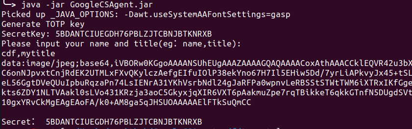

# GoogleCSAgent_cdf
CSAgent 与 GoogleAuth 的缝合体，cobalt strike4.4版本的破解+otp动态口令的agent

*止步于4.4,不再对该项目做4.5版本更新（4.5针对javaagent的暗桩有点多不想一个个改了。）*


编译：`mvn clean package -DskipTests`

使用方法：

## 先，生成otp的密钥：

命令：`java -jar GoogleCSAgent.jar`



data:image是二维码，复制到浏览器中用app扫即可；Secret是密钥，添加到teamserver中即可。

## 再，修改teamserver文件使用：

```
java -XX:ParallelGCThreads=4 -Dcobaltstrike.server_port=50050 -Djavax.net.ssl.keyStore=./cobaltstrike.store -Djavax.net.ssl.keyStorePassword=123456 -server -XX:+AggressiveHeap -XX:+UseParallelGC -javaagent:GoogleCSAgent.jar=5BDANTCIUEGDH76PBLZJTCBNJBTKNRXB -classpath ./cobaltstrike.jar server.TeamServer $*
```

未破解原版的cobaltstrike.jar用javaagent启动后就变成了个破解版带有GoogleAuth二次认证的了。


**PS：想修改成其他版本cs，需要修改GoogleCSAgent.java中76行“5e98194a01c6b48fa582a6a9fcbb92d6”为对应版本的key即可。**

各个版本的官方解密key：

```
4.0 1be5be52c6255c33558e8a1cb667cb06
4.1 80e32a742060b884419ba0c171c9aa76
4.2 b20d487addd4713418f2d5a3ae02a7a0
4.3 3a4425490f389aeec312bdd758ad2b99
4.4 5e98194a01c6b48fa582a6a9fcbb92d6
```

## 参考

https://github.com/HKirito/GoogleAuth.git

https://github.com/Twi1ight/CSAgent.git
